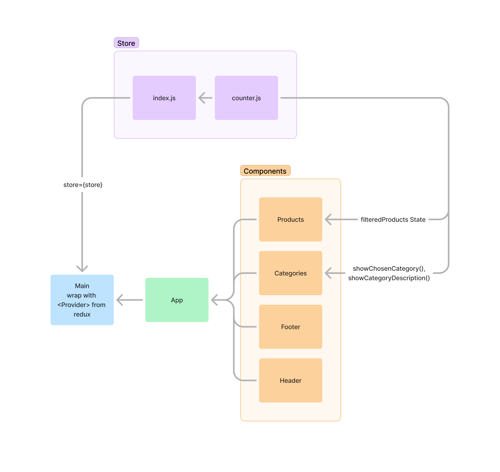
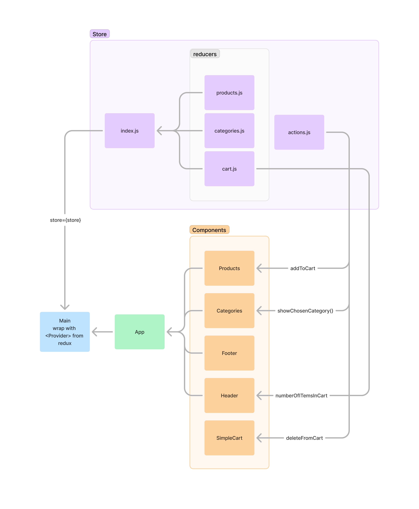

# 401 - Lab 37 - REDUX - Combined Reducers

## Project: Store Front

### Author: Melo

### Problem Domain

**Virtual Store Phase 1:** Start process of creating an e-Commerce storefront using React with Redux, coupled with live API server.

**Virtual Store Phase 2:** Continue work on the e-Commerce storefront, breaking up the store into multiple reducers and sharing functionality/data between components.

### Feature Tasks & Requirements

**Virtual Store Phase 1:**  

In this first phase, goal is to setup the basic scaffolding of the application with initial styling and basic behaviors. This initial build sets up the file structure and state management so that we can progressively build this application in a scalable manner.

The following user/developer stories detail the major functionality for this phase of the project.

* As a user, I expect to see a list of available product categories in the store so that I can easily browse products.
* As a user, I want to choose a category and see a list of all available products matching that category.
* As a user, I want a clean, easy to use user interface so that I can shop the online store with confidence.

**Virtual Store Phase 2:**  

 In phase 2, add the “Add to Cart” feature to application, which will allow users to not only browse items in the store, but also select them and have them persist in their “shopping cart” for later purchase.

The user stories from Phase 1 remain unchanged. For this phase, add the following new user stories to meet the new requirements.

* As a user, I want to choose from products in the list and add them to my shopping cart.
* As a user, I want to see the products that I’ve added to my shopping cart in a growing list on the side of the page”.
* As a user, I want to change the quantity of items I intend to purchase in the header. i.e. CART (1)
* As a user, I want to be able to remove an item from my shopping cart.

Application Flow:

* User sees a list of categories.
* Chooses a category and sees a list of products.
* Clicks the “Add to Cart” button on any product.
* Sees a list of all products in the \<SimpleCart /> side menu.
* Clicks the delete button on an item and sees the item removed (see stretch goals for this lab).
* Changes the cart total in the header. If two different products are in the cart you should see: CART (2)

### Technical Requirements/Notes

**Phase 1:**

* Create a visually appealing site using Material UI.
* Use a Redux Store to manage the state of categories and items in the store.
* Display a list of categories from state.
* When the user selects (clicks on) a category:
  * Identify that category as selected (change of class/display).
  * Show a list of products associated with the category.

**Phase 2:**  

* Continue to use Material UI Components for layout and styling.
* Add a “Cart” indicator to the header, like this: Cart (0).
* Create a new Cart component to show the items in the user’s cart.

### Application Architecture

* Create application using create-react-app.
* Install Material UI as a dependency.
* Write an \<App /> component that serves as the container for all sub-components of this application.
  * A \<Header /> component which shows the name of your virtual store.
  * A \<Footer /> component which shows your copyright and contact information.
  * A \<Categories /> component:
    * Shows a list of all categories.
    * Dispatches an action when one is clicked to “activate” it.
* A \<Products /> component:
  * Displays a list of products associated with the selected category.

### Notes on constructing Redux Store

**Phase 1:**

* Categories
  * State should contain a list of categories as well as the active category.
    * Each category should have a normalized name, display name, and a description.
  * Create an action that will trigger the reducer to change the active category.
  * Update the active category in the reducer when this action is dispatched.
* Products
  * State should be a list of all products.
    * Each product should have a category association, name, description, price, inventory count.
  * Create an action that will trigger when the active category is changed.
    * HINT: Multiple reducers can respond to the same actions.
  * Create a reducer that will filter the products list based on the active category.
* Active Category
  * State should store active category.
    * Other components (products, etc) might need to reference this.

**Phase 2:**

* Add a new component to the page: \<SimpleCart />
  * Displays a short list (title only) of products in the cart.
  * This should be present at all times.
* Home Page Operation:
  * When the user selects (clicks on) a category:
    * Identify that category as selected.
    * Show a list of products associated with the category, that have a quantity > 0.
    * Add an “add to cart” button to each product.
  * When a user clicks the “add to cart” button add the item to their cart:
  * In the \<SimpleCart /> component, show a running list of the items in the cart (just the titles).
  * Change the (0) indicator in the header to show the actual number of items in the cart.
  * Reduce the number in stock for that product.

## Documentation

### How to initialize/run application (where applicable)

* npm run dev

### Libraries needed (where applicable)

Install

* "@emotion/react": "^11.13.0",
* "@emotion/styled": "^11.13.0",
* "@fontsource/roboto": "^5.0.13",
* "@mui/material": "^5.16.5",
* "@redux-devtools/extension": "^3.3.0",
* "react": "^18.3.1",
* "react-dom": "^18.3.1",
* "react-redux": "^9.1.2",
* "sass": "^1.77.8"

Dev Dependencies

* "@types/react": "^18.3.3",
* "@types/react-dom": "^18.3.0",
* "@vitejs/plugin-react": "^4.3.1",
* "eslint": "^8.57.0",
* "eslint-plugin-react": "^7.34.3",
* "eslint-plugin-react-hooks": "^4.6.2",
* "eslint-plugin-react-refresh": "^0.4.7",
* "vite": "^5.3.4"

### Testing

* Test category component
* Test product component
* Test action and reducer from store

### React + Vite

This template provides a minimal setup to get React working in Vite with HMR and some ESLint rules.

Currently, two official plugins are available:

* [@vitejs/plugin-react](https://github.com/vitejs/vite-plugin-react/blob/main/packages/plugin-react/README.md) uses [Babel](https://babeljs.io/) for Fast Refresh
* [@vitejs/plugin-react-swc](https://github.com/vitejs/vite-plugin-react-swc) uses [SWC](https://swc.rs/) for Fast Refresh
